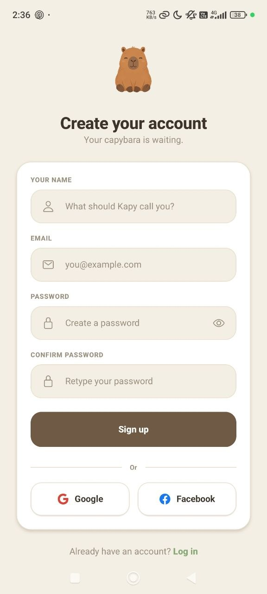
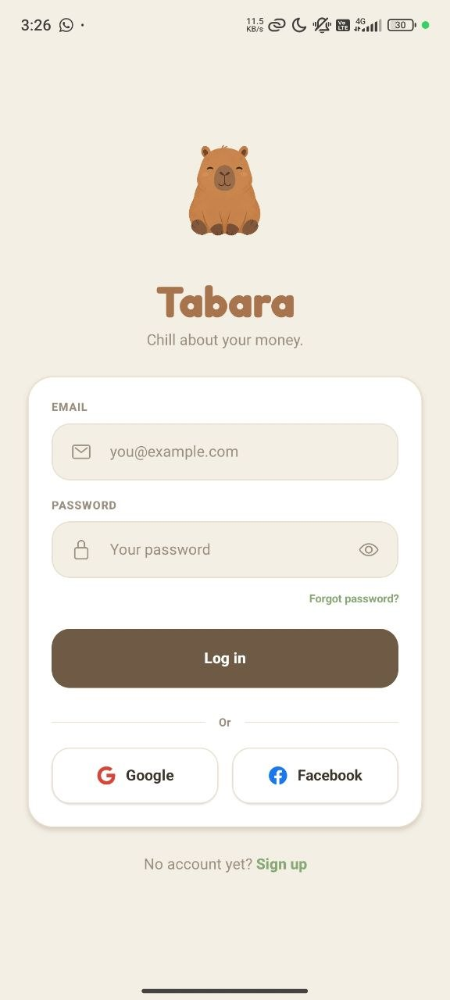
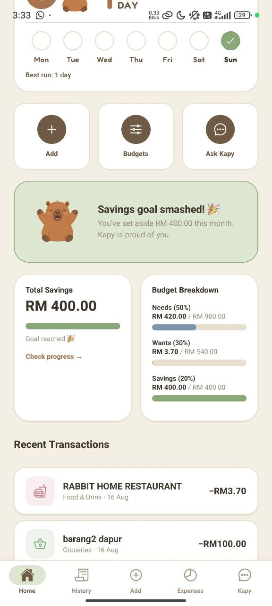
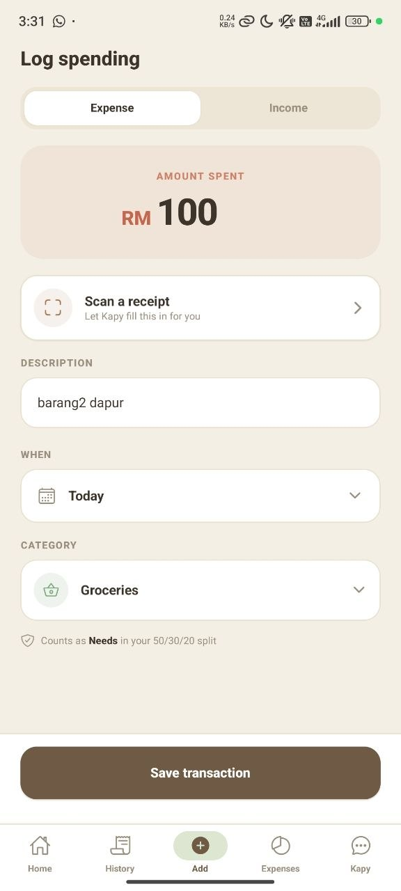
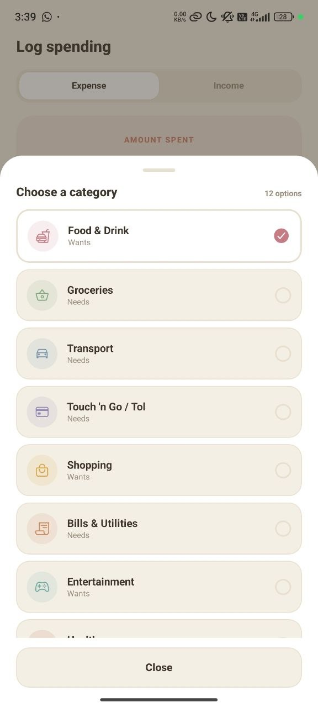
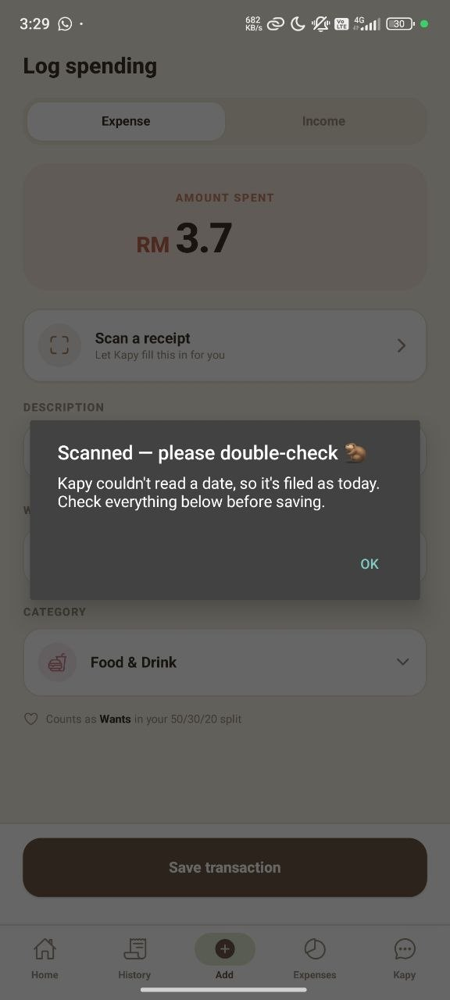
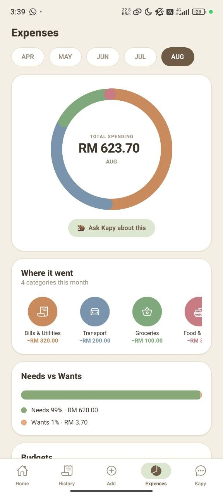

# Tabara 🦫

A personal finance app for young Malaysians, built around a capybara called
Kapy who reads your receipts, answers questions about your spending, and
notices when you stop logging.

React Native (Expo) · TypeScript · Supabase · Google Gemini

---

## What it does

**Track money without a spreadsheet.** Log income and spending, set a monthly
savings goal and per-category budgets, and see where it went — with the
50/30/20 split applied to real numbers rather than a template.

**Scan a receipt instead of typing.** Photograph it and Gemini reads the total,
the merchant, the category and *the date printed on the receipt* — Malaysian
receipts are day-first, so `03/04/2026` is 3 April. If the photo is hard to
read, the app says which fields it couldn't get instead of pretending.

**Ask Kapy.** A chat assistant that knows your actual budget, speaks Malay,
English or rojak back to you, and can record a transaction when you say
"masukkan RM 50 ke tabung".

**Keep a streak.** A Mon–Sun strip showing which days you logged, achievements
that unlock from real usage, and a flame animation when the streak hits a new
high. Kapy looks worried when today is still empty.

---

## Screens

### Getting in

<p>



</p>

Sign up with an email and password, or with Google or Facebook. The password
field enforces the same rules the server does and shows them as a live
checklist, so you find out what is wrong while typing rather than after
submitting.

Social sign-in runs through the system browser and always shows the account
chooser — on a shared phone, silently signing in whoever the browser last
remembered is the wrong default for a money app.

Forgot your password? A six-digit code arrives by email. A code rather than a
tappable link, because links have to deep-link back into the app and that is
unreliable on Android.

### Home — where the month stands

<p>



</p>

The balance at the top is **income minus spending minus what you have set
aside** — money you have actually put into savings has left your spendable
pool, so it is not counted as still available.

Underneath, the **50/30/20 breakdown** measures real spending against real
targets: needs, wants and savings, each with what you have used out of what
you had. Kapy's expression changes with it — chill under budget, careful near
it, stressed over it. A face reads faster than a percentage.

The **streak** shows a Mon–Sun strip of which days you logged. When it reaches
a new high a flame bursts across the screen. That fires once per milestone, not
on every launch, because a reward that repeats stops being one.

### Logging money

<p>


</p>

Amount, description, date, category — about ten seconds. The category list
changes with the Expense/Income toggle, so a salary cannot be filed under Food
and quietly skew the donut.

Every category is labelled **Needs** or **Wants**, and the line under the picker
tells you which side of the 50/30/20 split this transaction will land on before
you save it.

### Scanning a receipt

<p>


</p>

Photograph a receipt and Gemini reads the total, the merchant, the category and
the date printed on it. Malaysian receipts are day-first, so `03/04/2026` is
3 April — getting that backwards would file transactions in the wrong month for
most of the year.

Nothing the model returns is trusted. Dates are rejected unless they are real
calendar dates, not in the future, and within two years. And rather than a
blanket "Scanned!", the app says **what it could not read** — above, it could
not find a date, so it says so instead of silently filing the receipt as today.

### Seeing where it went

<p>


</p>

**Expenses** breaks the month into a donut by category, with a month switcher
along the top, a needs-versus-wants bar, and per-category budgets. "Ask Kapy
about this" hands the same figures to the assistant.

**History** is every transaction, searchable, filterable by Needs or Wants, and
grouped by day. Tap one to delete it.

### Kapy

<p>


</p>

Kapy answers using your actual numbers — above it quotes a real income, savings
goal and spendable budget rather than generalities. It replies in whatever
language you write in, including rojak, and it can record transactions for you:
say *"Kapy, saya belanja makan RM15 hari ni"* and it saves it.

It knows today's date and time in Malaysian time, so "semalam" resolves
correctly. It is never an authorisation boundary — row-level security decides
what it can see before it sees anything.

**Profile** carries your savings rate, XP level, streak and achievements. All of
it is computed from your transactions rather than stored, so none of it can drift
out of step with what you actually logged. The daily reminder is set up here too.

---

## Two design decisions worth explaining

### Nothing derived is ever stored

Streaks, achievements, XP, levels, alerts, the balance — none of it is written
to the database. All of it is computed from your transactions on every render.

The usual approach is a `streak_count` column updated on save. That works until
one write fails, or a transaction is deleted, or two devices sync — and then
the number on screen disagrees with the data behind it, permanently, with no
way to tell which is right.

Deriving costs a few milliseconds and makes that class of bug impossible.
`src/lib/insights.ts` and `src/lib/derive.ts` are pure functions over the
transaction list, which is also why they are straightforward to test.

### The AI is never an authorisation boundary

The Gemini key lives in a Supabase secret and never ships in the app bundle —
anyone can unzip an APK. Every AI call goes through an Edge Function that
verifies the caller's JWT first.

Authorisation happens in Postgres via row-level security **before** the model
sees anything, so Kapy can only ever work with data that already belongs to the
caller. The model cannot write SQL; it can only call one narrowly-typed tool,
whose every argument is re-validated server-side.

Text read off a photographed receipt is treated as hostile — a merchant name is
sanitised, length-capped and fenced inside a labelled block, because that string
reaches a model holding a tool that can write to the database.
See `supabase/functions/_shared/sanitize.ts`.

---

## Running it

Requires Node 22+, a Supabase project, and a Gemini API key.

```bash
npm install
```

Create `.env`:

```
EXPO_PUBLIC_SUPABASE_URL=https://<your-project>.supabase.co
EXPO_PUBLIC_SUPABASE_ANON_KEY=<your-anon-key>
```

The anon key is safe to ship — RLS is what protects the data. The Gemini key is
**not** in `.env`; it belongs in a Supabase secret.

Set up the backend:

```bash
npx supabase link --project-ref <your-project-ref>
npx supabase db push
npx supabase secrets set GEMINI_API_KEY=<your-key>
npx supabase functions deploy kapy
npx supabase functions deploy scan-receipt
npx supabase functions deploy delete-account
```

Then run the app:

```bash
npx expo start
```

Google and Facebook sign-in need a development build rather than Expo Go, since
the OAuth redirect has to return to the app's own URL scheme:

```bash
npx expo run:android
```

---

## Tests

```bash
npm test
```

60 tests, no test framework installed — Node 22's built-in runner and its
TypeScript support do the work. Coverage is aimed at logic that has been wrong
before or would fail silently: the month's money maths, streak date arithmetic,
receipt date validation, and the prompt-injection defences.

See [`tests/README.md`](tests/README.md).

---

## Layout

```
src/
  app/            Screens (expo-router, file-based)
    (auth)/       Welcome, login, signup, password reset
    (tabs)/       Home, Add, History, Insights, Kapy
  components/ui/  Shared UI
  lib/            Data layer, auth, derived state, AI client
  constants/      Theme tokens and categories
supabase/
  migrations/     Full schema — tables, RLS, triggers
  functions/      Edge Functions (Deno)
tests/            Unit tests over the pure logic
docs/
  screenshots/    App screens
  privacy.html    Privacy policy
```

---

## Notes

Built as a UTHM mini-project. Originally on Firebase, migrated to Supabase.

Not published to the Play Store. Doing so would need a real package name
(currently the Expo placeholder), a signing key, a published privacy policy URL,
and a verified sending domain so confirmation email reaches addresses other than
the developer's own.

The honest limitation of the app itself: it still depends on you remembering to
log. Receipt scanning and streaks reduce that friction; they don't remove it.
The most valuable thing to build next would be reading Malaysian bank
transaction notifications, turning "remember to log" into "confirm what we
noticed".
